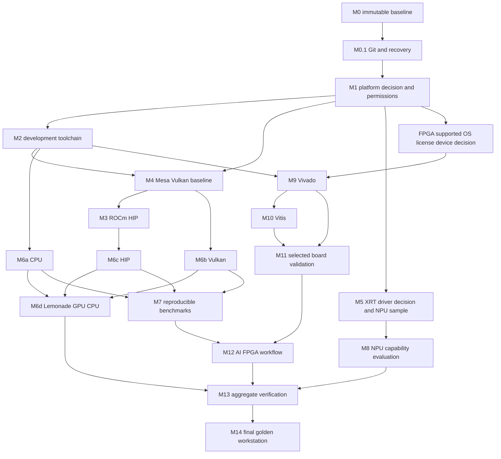

# AI370 2 MASTER PLAN REVIEW

原始 review 日期：2026-09-30（Asia/Taipei）。以下 review 內容是當日規劃快照；「implementation not started」只描述該 review 寫成時的狀態，不代表目前狀態。後續實際結果以各 milestone result document 為準，現行 M0–M15 狀態統一見 [`ROADMAP.md`](ROADMAP.md)，詳細時間統一見 [`EXECUTION_TIMELINE.md`](EXECUTION_TIMELINE.md)。

**目前狀態索引（2026-10-01）：** M0–M10 已有部分或全部實際執行紀錄，但 PASS 範圍不擴張；M0.1、M1、M8 為 PARTIAL；M7.1 為 OPEN；M11 DEFERRED 等待 SP701/JTAG target；M12–M15 為 PLAN。AMD Ross 已列入 M13，尚未安裝或驗證。Roadmap 為唯一詳細里程碑狀態來源。

本文件是施工建議，不是安裝授權或階段 PASS。此次只讀取既有證據、檢視安裝包 metadata／腳本與查詢官方文件，新增本 review；沒有安裝、更新、修改 Kernel／BIOS／driver／權限、初始化 Git 或進入 M0.1。

## 1. Review 結論與依據

Master Plan 的方向合理，但不宜直接按原順序執行。主要修正：

1. 先建立可恢復的系統備份與 Git 證據流程，再修改平台；Git commit 不等於系統 rollback。
2. Mesa/Vulkan 基準移到 ROCm 前；ROCm 使用目前內建 amdgpu 的路線，避免額外 GPU DKMS 或替換桌面 graphics stack。
3. NPU 階段拆成權限、userspace ABI、驅動決策、推論四個關卡。**現有 XRT plugin 確實包含自動 DKMS 操作，不能整組直接安裝。**
4. llama.cpp CPU／Vulkan／HIP 分別建置與驗證；Lemonade 放在直接 backend 驗證之後。
5. Vivado/Vitis 2026.1 與 Ubuntu 24.04.4 存在官方支援缺口，先決定隔離環境或例外驗證方案，不為 FPGA 降級整個 AI host。
6. M13 的 audit／verify／記錄從 M0.1 起逐階段建立，最後才做整合；不要最後才補腳本。

本機依據：[M0_BASELINE.md](M0_BASELINE.md)、[M0/inventory.json](M0/inventory.json)、[DOWNLOAD_PREPARATION.md](DOWNLOAD_PREPARATION.md)、[download-verification.json](download-verification.json)、[rocm-dependency-review.json](rocm-dependency-review.json)、既有資源 manifest 與安裝包內容。舊 SER9 結果僅作 reference。

### M0 已確認與尚未證明

| 項目 | 本機證據 | Review 判斷 |
|---|---|---|
| OS／Kernel | Ubuntu 24.04.4、6.17.0-14-generic | 保留為首個候選平台，尚未有 workload PASS |
| BIOS／CPU | BIOS 1.06、HX 370、12C/24T | 不因建置環境而預設更新 BIOS |
| RAM | Linux MemTotal 46.66 GiB | DIMM 實體容量未確認；不可宣稱已有 64 GB RAM |
| GPU | Radeon 890M、內建 amdgpu、KFD 裝置存在 | gfx1150 為建置目標；以 rocminfo/HIP 實測確認 |
| NPU | XDNA2、內建 amdxdna、accel0 存在 | driver loaded 不等於 runtime／推論已驗證 |
| 權限 | shen 可存取 renderD128；kfd／accel0 受限 | 未來以必要群組／udev 與新登入 session 處理 |
| 桌面 stack | Mesa 25.2.8、Vulkan loader 1.3.275 | 尚未有 Vulkan 計算測試，先建立基準 |
| 磁碟 | ext4 root、EFI vfat，M0 可用約 681.71 GiB | 非原生 Btrfs snapshot 架構；空間不是無限 |
| Git | 專案無 repository | 本次保持此狀態 |

M0 日誌已有 HDMI/MES、ACPI 等提示；後续以測試前後日誌差異判斷新增 regression，不把所有既存警告當新失敗，也不宣称基線完全無錯誤。

## 2. Recommended architecture

### Host 與環境隔離

Host 保留 Ubuntu 24.04.4 + 現有 Kernel／內建 amdgpu／amdxdna，優先建立穩定 desktop、Vulkan 與 HIP。M1 再審查安全更新、來源和精確 transaction；版本鎖定是建置期間的受控策略，不是永久停止安全維護。

| 環境 | 建議角色 | 隔離方式 |
|---|---|---|
| 系統 graphics | Mesa/RADV、Wayland、正常桌面 | 保留 Ubuntu 套件，記錄 ICD／library provider |
| ROCm 7.2.1 | HIP 工具與 Radeon compute | 最小必要套件；環境設定限 launcher／指定 shell |
| llama.cpp | CPU、Vulkan、HIP 三條可比較路線 | 同一 source commit，三個 build/output 目錄 |
| GPU Python | 可選 PyTorch 能力測試 | 獨立 Python 3.12 venv；非原生 llama.cpp 必要依賴 |
| Ryzen AI 1.7.1 | NPU sample、ONNX／量化模型 | 獨立 venv；XRT userspace/provider 須單一明確選擇 |
| Lemonade | Local AI 服務與 backend 管理 | GPU/CPU 先行；固定 backend 版本與 service 行為 |
| Vivado/Vitis 2026.1 | RTL／embedded／HLS | 獨立 toolchain launcher；先解決支援 OS 的隔離方案 |

不要全域設定互相覆蓋的 LD_LIBRARY_PATH、PYTHONPATH、XRT_ROOT 或 FPGA toolchain PATH。Python venv 能隔離 Python dependencies，但不能隔離系統 XRT libraries、Kernel driver 或 firmware。

FPGA 2026.1 建議先評估 Ubuntu 24.04.3 的獨立 VM。其 userspace 與 guest Kernel、USB/JTAG、磁碟／記憶體配置都要驗證。Container/chroot 可隔離 userspace，但共用 host Kernel，不能因此宣稱完整官方 Kernel 相容。這是待確認方案，本次不建立 VM／container。

若選擇直接在 24.04.4 安裝 2026.1，應另立「未列入官方支援、接受本機驗證」決策，不能把可啟動等同官方支持。2026.2 也不能在未變更需求前取代指定的 2026.1。

### Shared memory 與工作負載

GPU 的 16 GiB UMA、約 23.33 GiB GTT 與 Linux RAM 不可相加當成模型容量。模型權重之外還要預留 KV cache、runtime、桌面與 FPGA 工具記憶體。先測 0.6B／4B，再擴大模型、context、offload；最初 CPU／GPU／NPU／FPGA 重負載串行執行。

先保留 BIOS UMA 配置；只有證據顯示需求時才獨立評估 UMA／TTM 變更。cgroup RAM 限制不是所有 GPU/GTT allocation 的完整上限。

## 3. Corrected phase order (historical proposal)

本節表格保留 2026-09-30 review 當時的建議次序，不是現在的進度表；實際 M0–M10 結果及新 M11–M15 定義以 `docs/ROADMAP.md` 為準。M13/M14 的舊定義已由 M13 Ross、M14 Automation、M15 Final Golden Workstation 取代，不改寫既有 result/evidence。

保留原 phase ID，執行順序調整如下。每個可修改子階段仍須 PLAN → PRECHECK → INSTALL/CONFIGURE → VERIFY → DOCUMENT → GIT COMMIT，通過才前進。

| 建議順序 | Phase | 範圍及必要修正 |
|---|---|---|
| 0 | M0 | 已完成盤點；不重新覆寫原始證據 |
| 1 | M0.1 | fresh repo、忽略規則、可恢復備份方案、Golden Baseline commit；開始 M13 記錄規格 |
| 2 | M1 | APT/package/source 狀態、官方矩陣、permissions、精確版本與 rollback 決策；不預設升級 |
| 3 | M2 | 保留既有 GCC/Git/Make；補 CMake/Ninja/venv 等必要工具；VS Code 為獨立小 transaction |
| 4 | M4 | 先驗證現有 Mesa/RADV，再補 loader 診斷／Vulkan build dependencies |
| 5 | M3 | 最小 ROCm/HIP；實際 gfx1150 kernel compile/run；重驗 desktop/Vulkan |
| 6 | M5a–d | permissions → XRT/provider/driver 預檢 → 有條件 runtime 安裝 → NPU sample；每步分開記錄 |
| 7 | M6a–c | 同 commit 建置 CPU、Vulkan、HIP；各自 CLI/server smoke test |
| 8 | M6d | Lemonade GPU/CPU 最小安裝與 backend pin；NPU 功能另設 gate |
| 9 | M7 | 固定模型、參數與 build 的 CPU/Vulkan/HIP benchmark，加工程任務品質測試 |
| 10 | M8 | NPU supported model／ONNX／量化測試；獨立於 GGUF backend 比較 |
| 11 | M9 | OS 環境方案、license、device 選擇、空間預檢後，Vivado Tcl/batch/synthesis |
| 12 | M10 | 沿用統一 installer／tool tree，追加必要 Vitis 組件；compiler/HLS/platform 驗證 |
| 13 | M11 | 已選 board 後，依類型補 board files／BSP／JTAG，完成硬體驗證 |
| 14 | M12 | human-reviewed RTL/Tcl → batch → report → LLM；受限工作目錄、命令與資源 |
| 15 | M13 | 收斂各 phase 已建立的 scripts，full health check 與重建驗證 |
| 16 | M14 | 最終版本／證據矩陣、問題、恢復文件、Git tag 與離機備份 |

M6a CPU 在 M2 後即可先完成；M5 與 GPU userspace 是功能上不同分支，但共享 Kernel／firmware，所以實際修改不並行。M9/M10 不依赖 M7/M8 的效能結果，可以在平台穩定且支援 OS 決策完成後提前安排；上表串行順序方便歸因。

### 可以合併與必須拆開

- 合併 M1/M4 的初始只讀圖形檢查；Vulkan 建置與功能 gate 仍獨立保存。
- M9/M10 共用一次 Unified Installer 解包與工具組件規劃，避免重复下載／完整複製；Vivado 與 Vitis 分別驗證、commit。
- M13 改成全程要求，最末只是整合。M0.1 建立紀錄格式即可，不必一次寫完所有未驗證安裝腳本。
- M2 拆成命令列 toolchain、Python、VS Code；Node/npm 僅有實際前端需求才處理。
- M3 拆開 HIP 基础與可選 PyTorch；M5 拆開 userspace 和任何 DKMS／firmware 變更。
- M6 拆三 backend 與 Lemonade，M7 拆 smoke、單一 benchmark、較長 stability；不能大量安裝後一次驗收。

## 4. Dependency graph

箭頭表示功能依賴；M5 若改系統 driver，還必須重新通過 M3/M4/M6 GPU regression gate。M11 純 RTL 板卡可不依賴 Vitis；圖中的 M10→M11 適用需要 embedded BSP/platform 的板卡。

## 5. Version/compatibility concerns

### 建議版本表與限制

| 組件 | 首選／保留版本 | 相容性與決策 |
|---|---|---|
| Ubuntu | 24.04.4 | ROCm Ryzen 7.2.1 matrix 列支持；FPGA 2026.1 未列支持 |
| Kernel | 6.17.0-14-generic | 當前 baseline；保留可開機版本，不直接跳 OEM 或更高 Kernel |
| amdgpu／amdxdna | 此 Kernel 內建版本 | 非預設 DKMS；任何替換另設重大變更階段 |
| Mesa／libdrm | M0 套件版本 | 保留，變動須 desktop+Vulkan+HIP regression |
| ROCm／HIP | 7.2.1／對應 70201 packages | 全部同一 release，不混用其他 ROCm repository |
| GPU Python | Python 3.12、PyTorch 2.9.1 ROCm 7.2.1 wheels | 獨立 venv；官方 Ryzen 矩陣僅驗證 FP16 |
| Ryzen AI | 1.7.1 | 先驗證 SDK 的四件 XRT package 與內建 driver 能否配合 |
| SDK XRT | base/base-dev/npu 2.21.75、plugin 2.21.260102.53 | 成套 ABI；plugin 實際有 DKMS，不能當無 driver 變更方案 |
| Lemonade | 2026.39.1~24.04 | server package 不硬依賴 XRT/DKMS；先 GPU/CPU |
| llama.cpp | v0.5.0，commit 7fe450e19305b828c199d602c23a8337aaa1f03b | 三 backend 同 commit；模型架構支援另驗證 |
| Vivado／Vitis | 2026.1，0616_1700 installer | OS 支援與 component/license 選擇先決；禁止默默升 2026.2 |
| IDE／uv | VS Code 1.139.1、uv 0.12.21 | 已下載；extension 只選穩定目錄，記錄精確版本 |

ROCm Ryzen 官方矩陣明列 Ubuntu 24.04.4、HX 370 與 gfx1150 系列，配套 PyTorch 2.9.1/Python 3.12；這不代表每個 GGUF 量化 kernel 已驗證。[官方 Ryzen 7.2.1 matrix](https://rocm.docs.amd.com/projects/radeon-ryzen/en/docs-7.2.1/docs/compatibility/compatibilityryz/native_linux/native_linux_compatibility.html)

ROCm 7.2.1 release notes 包含 Ubuntu 24.04.4 的 6.17 HWE 支援；Ryzen 安裝指南另寫 OEM 6.14-1018 或較新版本，且要求內建 amdgpu／no-DKMS。這兩份文件的適用範圍需在 M1 明確記錄，不能把版本號較大當完整等價證明。建議先保留現有 6.17 實測；若失敗再比較官方 Kernel 路線。不要退回 6.8 而忽略 NPU 要求。[ROCm release notes](https://rocm.docs.amd.com/en/docs-7.2.1/about/release-notes.html)、[Ryzen installation](https://rocm.docs.amd.com/projects/radeon-ryzen/en/docs-7.2.1/docs/install/installryz/native_linux/install-ryzen.html)

Ryzen AI 1.7.1 Linux 文件要求 Ubuntu 24.04、Kernel ≥6.10，推薦 Python 3.12／64 GB RAM。現有 Linux 可見 RAM 不足以證明實體容量是否符合推薦值，先確認 DIMM／BIOS 資料；不把推薦值當所有 sample 的最低硬門檻。[Ryzen AI Linux requirements](https://ryzenai.docs.amd.com/en/1.7.1/linux.html)

AMD OS 表將 Ubuntu 24.04.4 對 Vivado／Vitis Embedded 2026.1 標為 No，24.04.3 為 Yes。Vitis UG1742 2026.1 列 24.04.3、測試 Kernel 6.17.0-14，但 Alveo XRT deployment 腳註又排除 HWE；不可由同一 Kernel 字串推出整個 host 已正式支持。Embedded/HLS RAM 最低 32 GB、推薦 64 GB；Acceleration 最低 64 GB、推薦 80 GB。表列 Vitis Embedded 35 GB／Full Vitis 200 GB，實際依組件變動。[AMD OS support table](https://www.amd.com/en/support/adaptive-socs-and-fpgas/installer-info-general.html)、[Vitis 2026.1 UG1742 requirements](https://docs.amd.com/r/en-US/ug1742-vitis-release-notes/Installation-Requirements)

### 實際下載包的衝突風險

**A. SDK plugin 不是 userspace-only。** 唯讀檢查檔案：

`resources/Agent_Tools_Docs/03_RyzenAI/XRT_NPU/xrt_plugin.2.21.260102.53.release_24.04-amd64-amdxdna.deb`

其 `postinst` 直接呼叫 `/opt/xilinx/xrt/share/amdxdna/dkms_driver.sh --install`，寫 `/etc/udev/rules.d/99-amdxdna.rules` 為 `MODE="0666"`，執行 `rmmod amdxdna` 與 `modprobe amdxdna`。這是本地包內容證據，並非推測。禁止將四個 SDK DEB 一起安裝後才發現 driver 已被換掉。

M5 預檢要確認 vendor 支持的 inbox-driver/userspace 組合；若原樣安裝必須換 driver，先提出獨立 driver 變更計畫與 rollback。跳過 plugin、手動取出 library、修改 maintainer scripts 都不自動等於支持方案；本次不採用或實作。

**B. Lemonade PPA 的整庫下載不是安裝清單。** 現有目錄另含：

- `amdxdna-dkms` 7.0.0-rc1+git20260310.6b13cb8f4-noble1。
- `xrt-xocl-dkms`、libxrt2／libxrt-npu2／相關 utils，實際 package epoch/version 為 `1:2.25.0-4~noble1`。
- libxrt-alveo2、desktop/dev 等未必需要的組件。

不要與 SDK XRT 2.21 混裝，也不要因目錄名稱 Lemonade 就全部安裝。XRT package 名稱不同，APT 未必會阻擋雙 provider／loader path／ABI 問題。已讀取的 lemonade-server Depends 沒有 XRT／amdxdna-dkms 硬依賴，因此 GPU/CPU 首階段可以規劃不含它們的 allowlist；仍須檢查完整 dependency solver、maintainer scripts、backend 自動下載與 service 啟動行為。

**C. 357 個 Ubuntu DEB 是依賴材料 superset。** 內含可能變更 systemd／udev／Python／libraries 的套件；不能 `apt install *.deb`。現有 dependency-review 的「0 missing」僅是宣告依賴靜態比對，不是 APT transaction、衝突、ABI、離線閉包或執行 PASS。

**D. Python 與 FPGA XRT 界線。** Ryzen AI SDK 內的 CPU torch 2.5.1 與 GPU torch 2.9.1 分開；不要系統 pip 或混成同一 venv。純 Vivado RTL／JTAG 與一般 embedded BSP 不應預設需要 host Alveo xocl driver。只有確定 Alveo 加速／deployment 需求後才規劃相符 XRT，避免與 NPU provider 撞路徑。

## 6. Major risks

| 風險 | 影響 | 控制方法 |
|---|---|---|
| 隱含 DKMS 安裝 | 改 inbox driver、module/firmware regression | 審查 DEB scripts、精確 allowlist；重大變更前 image checkpoint |
| XRT 2.21/2.25 混裝 | ABI/provider 不明、NPU/FPGA runtime 互相干擾 | 固定單一 provider；記錄 package/file ownership、ldd、環境路徑 |
| ROCm 牽動桌面 | Mesa/ICD/Wayland regression | 內建 amdgpu、no-DKMS；每 transaction 後 Vulkan/desktop regression |
| Kernel/firmware/BIOS 同時更新 | 無法辨識故障来源 | 一次一層；保存前後版本、重開機與回復結果 |
| UMA/模型超量 | RAM/GTT 壓力、swap、GPU fault／hang | 小模型起步、限制 context/concurrency；監測與停止條件 |
| FPGA OS 不支持 | 可啟動但不具完整工程支援 | VM 等方案或明確例外；實際 synthesis/implementation gate |
| FPGA extraction+安裝+VM | 本機空間不足，備份失敗 | component estimate、單份 extraction、實測峰值空間、保留餘量 |
| 工具 env 全域污染 | 系統 Python/compiler/XRT 不可重現 | 每工具 launcher／venv，記錄實际 executable/libraries |
| SHA 被誤當安全/功能證明 | 完整檔案仍可能不適用 | 區分來源、簽章、checksum、安裝與 workload 驗證 |
| 舊 SER9 PASS 被繼承 | 新機證據不成立 | 新 project identity、獨立測試與 phase result |

舊 SER9 的 GPU fault／TTM／soft lockup 記錄可作測試停止條件參考，但根因未確定，不能判定新機同樣有問題，也不能宣稱必由 NPU 造成。遇到新增 GPU reset、page fault、lockup、持續 swap 壓力時停止擴大測試、保存證據，不自動重試。timeout 不保證可終止 Kernel D-state 工作。

## 7. Missing resources 與不需要的工作

### 已有材料足以開始哪些工作

本機已有 ROCm 7.2.1 DEB、GPU wheels、toolchain/Vulkan DEB、SDK 1.7.1/XRT 2.21、固定 llama.cpp source、Lemonade 包、VS Code/VSIX、2026.1 Unified Installer、board source 與多個 GGUF。下載清單 489 個檔案約 9.112 GiB；原 T7 材料約 160 GiB。這些是準備完成的資料，不是批准全部安裝。

現有 Qwen 小模型足以 CPU/Vulkan/HIP smoke。35B 模型、Gemma 31B 與多模態 projector 無須先用；依模型架構確認該 llama.cpp commit 支持情況，缺支持時另作 source 版本決策。

### 尚缺或尚未證實完整

| 材料／決策 | 用途與處理時機 |
|---|---|
| 当前平台 recovery media／exact kernel+firmware package 集 | M0.1：已有 24.04.1 ISO 不等於当前 24.04.4/6.17 的可重建介質 |
| 可恢復 system image、EFI/partition/config 備份與恢復演練 | M0.1：T7 installer backup 不是 system image |
| 官方簽章可信鏈 | ISO SHA 已比對、GPG 簽章只保存；後續核對 key fingerprint/簽章；其他來源按發布方式處理 |
| 每階段精確 package allowlist／版本閉包 | M1/M2/M3/M5：APT simulation、dependencies、scripts、供應來源／簽章須確認 |
| 完整 Python wheelhouse/lockfile | GPU/NPU 分開解析；SDK install scripts 的額外網路下載尚未形成完整離線閉包 |
| NPU LLM 參考模型 | `amd/Phi-3.5-mini-instruct_rai_1.7.1_npu_4K` 尚未取得；GGUF 不可替代，M8 前核對 revision/license |
| XRT+inbox driver 的支持組合證據 | M5 前；目前 plugin 隱含替換 driver，這是必要決策而非再下載另一份 driver 就解決 |
| FPGA 2026.1 支持 OS 的介質／環境方案 | M9 前；若選 VM 再準備 ISO、配置与 recovery，現階段不下載 |
| 選定器件／board／license entitlement | M9 決定 device subset；M11 前才補對應 board/BSP/platform/cable 資源 |
| 2026.1 相符 board/platform revision | 現有固定 commit 不代表支持2026.1；逐板核對 release/branch |
| 工程品質測試集 | M7/M12：RTL/Tcl/testbench、log/report 固定案例與正確答案、license/provenance |

舊機最新 bundle 與故障紀錄 commit 不一致屬歷史 reference 缺口，**不阻擋 clean rebuild**，不要為此匯入旧 main 或繼承驗證結果。此 review 不新增下載。

### 空間規劃

2026.1 TAR 約 98.275 GiB，完整 extraction 另需約同級空間；已下載 installer 的占用已包含在 M0 free 值中。再預留 selected install、build、model、VM image、backup staging、FPGA projects 與至少數十 GiB 系統餘量。

以「解包約 100 GiB + Vitis full 表列約 200 GB + VM/模型/工作區」作初步上限情境，不把它當精確 installer demand，也不簡單相加 Vivado/Vitis 因共享組件可能重疊。M9 PRECHECK 以選定組件顯示值與實際可用空間定案；不足則縮選 device 或調整磁碟方案。

T7 備份後剩餘約 187 GiB（歷史值，使用前須再檢查）；未必足以 current system image 或完整 workstation backup。exFAT 不保留 POSIX metadata，system/config/repo 備份需適當 image／archive 與恢復工具。資源 SHA 正確也不能證明整個外接檔案系統健康。

### 不需要預設執行

- blanket apt upgrade/full-upgrade、重裝已存在的 GCC/Git/Make、無證據 BIOS 更新。
- 額外 amdgpu DKMS、PPA amdxdna DKMS、xocl/Alveo packages、修改 NPU 為 0666。
- `HSA_OVERRIDE_GFX_VERSION` 偽裝其他 GPU、先改 UMA/TTM／swap 追求大模型。
- 全部 ROCm libraries、所有 FPGA device/board packages、兩份完整 Unified Installer extraction。
- llama.cpp 為了 HIP 而先安裝 PyTorch、NPU 可用後宣稱 llama.cpp 原生支援 NPU。
- 預設 Docker/Conda/Node 更新、預覽 VSIX、Git LFS 管理大型 installer、舊 repo bundle 當新機 root history。
- 尚未選 FPGA board 就安裝所有 BSP/platform。純 RTL 板卡不一定需要 BSP／embedded Vitis flow。

## 8. Proposed verification gates

每份結果保存 host identity、時間、phase、精確版本、命令、exit code、stdout/stderr、input/model SHA、來源、config、前後 package 差異、測試期間 Kernel log 與 commit。狀態區分 PLANNED／NOT RUN／PASS／FAIL／DEFERRED；支援例外另列 APPROVED EXCEPTION，功能 PASS 不抹去官方支援缺口。

| Gate | 必須證明的結果 |
|---|---|
| M0.1 | tracked baseline/manifest 正確、大檔未進 Git；離機備份可讀與恢復方法可操作 |
| M1 | package/source/version 決策明確、transaction 無未知移除/driver替換；既有 boot/desktop/PCI 正常 |
| M2 | C/C++ compile/run、CMake/Ninja 小專案、Python venv/pip 隔離；IDE 若裝則基本編譯debug |
| M4 | vulkaninfo 選中 Radeon/RADV，最小 compute 結果正確；非 lavapipe software fallback |
| M3 | rocminfo 真實 device target、hipconfig、HIP compile/run 與數值驗證；新登入權限；desktop/Vulkan 重驗 |
| M5 | module provenance、firmware、XRT provider/version、accel access；NPU sample 實際 offload 和結果正確；CPU fallback 不算 NPU PASS |
| M6 | 三個獨立 binary/build config；CLI/server 回答；GPU backend/offload 實際啟用且無新增 fault；CPU fallback 清楚標示 |
| M6d | Lemonade provider/model/backend 可追溯；service/port/config 可控，失敗可停服務與回退 |
| M7 | 同模型/SHA/prompt/context/batch/thread/offload；warmup、至少3次可比較量測、pp/tg與RAM/GPU/GTT/swap；coding 正確性與較長穩定性另記 |
| M8 | 支持的模型格式／量化／context、compile與inference、NPU使用證據及輸出；分開標示 NPU/GPU/hybrid |
| M9 | Vivado 2026.1版本、license/device、Tcl batch、指定 part 的 simple synthesis；OS例外/隔離記錄 |
| M10 | Vitis版本、compiler與最小 HLS或embedded compile；需要時才驗 platform/BSP/XSA相容 |
| M11 | selectedboard exactrevision、JTAG detection、synthesis/implementation/bitstream、program與可觀察硬體結果 |
| M12 | LLM產出先經人工審核；RTL模拟/語法、受限Tcl batch、log/report鏈可追溯；硬體 programming另受控 |
| M13/M14 | reboot後全healthcheck、依賴/環境污染檢查、至少一個重建/恢復演練與finalmatrix |

Benchmark 先固定小模型與保守 context；完成測試再逐項增加。M7 同時評估 RTL/Tcl 正確性、可重現性與人工修正成本，不以 tokens/s 代替 FPGA 助手品質。FPGA performance timing closure 和硬體成功要與 synthesis PASS 分開。

## 9. Proposed rollback checkpoints

当前 ext4 partition 結構不支持直接假設原生 Btrfs/LVM snapshot。先比較可恢復的離線 disk/partition image 與 ext4-compatible file backup；若使用 Timeshift 類工具，先明確其 coverage、EFI/boot、home/resource exclusions 與 live recovery，不宣稱一鍵保護全部。

| Checkpoint | 時機 | 必須保存／回復驗證 |
|---|---|---|
| CP0 Golden M0 | 任何系統變更之前 | image/config/EFI/partition metadata、package/version/source、M0證據、恢復介質；checksum與抽樣恢復 |
| CP1 Platform | M1涉及kernel/firmware/permissions前後 | 已知可boot kernel+headers/modules、GRUB/initramfs/config/firmware；新版本單獨boot測試 |
| CP2 Graphics/toolchain | M2/M4完成、M3之前 | Mesa/libdrm/ICD versions、compiler/build evidence；desktop+Vulkan基準 |
| CP3 GPU compute | M3/M6 GPU通過 | ROCm package list/env/binaries與smoke；NPU driver重大變更前另作系統checkpoint |
| CP4 NPU | 每次XRT/amdxdna/firmware重大變更之前 | 舊module/firmware、DKMS狀態、udev、provider/env與完整image；回復後重驗GPU+NPU |
| CP5 FPGA | installer/cable rules/daemon/systemlibs前 | selectedinstall配置、toolenv、license處理、service/udev差異；不把license秘密進Git |
| CP6 Final | 整合與finaltag | finalimage+repo bundle+外部resource manifest、完整verify與restore/rebuild文件 |

僅保存舊 Kernel 不足以回復已變動的 userspace、firmware、udev 或 DKMS。回退方案應包含停服務、恢復精確套件與設定、module/firmware/initramfs、重開機與驗證；APT downgrade 不是所有變更的可靠逆操作。任何 BIOS 變更另需確認 vendor recovery/降版可行性，沒有保證則保留 1.06。

## 10. Recommended Git strategy

目前 repository 仍不存在。以下全部是 M0.1 待執行建議：

1. `/home/shen/AI370-2` 初始化 fresh repo、`main`；首個 Golden Baseline commit 收錄現有 M0、此 review、README與資源來源/版本/SHA manifest。不要匯入SER9 main為新機驗證歷史。
2. 目錄用 baseline/、docs/、verify/、scripts/、resources/、output/；baseline 原始資料不可覆寫。舊 collect_m0.py 會刷新既有資料，未來改成 timestamped evidence 路徑後才重跑。
3. `.gitignore` 排除 installer/DEB/wheel/ISO/GGUF/SDK/extraction/build/venv/cache/output大檔、license/token/credentials與個人設定。資源 manifest 放 tracked docs 或明確 allowlist 的小型 metadata；不直接忽略證據卻留下無法追溯的連結。
4. 原始大型 logs/output 留於外部artifact；把必要小型結果、摘要與artifact SHA/index 提升到 tracked docs/baseline。區分工作區 artifact 與可分享工程證據，檢查個資再上GitHub。
5. 每個phase/subphase用一個可review的 change，加PLAN/PRECHECK/VERIFY結果；失敗可commit診斷文件，但不能以此宣告PASS或進下一階段。
6. tag 建議 `ai370-2-m0-golden`、各已驗證milestone、`ai370-2-final-golden`；tag只對應已完成證據，不預先建立。
7. 先本機版本紀錄與离機 repo bundle backup；GitHub visibility、帳號、authentication與remote在後續確認，這次不建立remote或push。
8. 可重建腳本預設check/plan，install動作明確、版本固定、失敗停止，不內含無条件upgrade、curl直接執行或不受控自動重試。

## 11. 下一階段開始前需要定案的事項

（歷史建議，2026-09-30）M0.1前先確認本review與recovery範圍；M1定案當時Kernel的驗證路線和精確transaction。M5前定案XRT/inbox-driver或有獨立rollback的DKMS路線。M9前定案2026.1的支持OS方案、device subset、license及空間。M11前才決定實際board。其後已選定 SP701；當前執行狀態以 `docs/ROADMAP.md` 為準。

**歷史 review 停止聲明：** review 撰寫時後續 phase 尚未開始。之後各階段進度以各自 commit/result 為準；不要把本句套用到目前狀態。現行規劃請讀 `docs/ROADMAP.md`。
